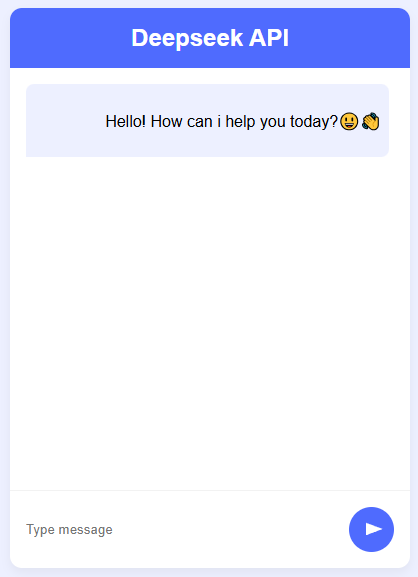

# DeepSeek API Web Interface

Простой и элегантный веб-интерфейс для взаимодействия с DeepSeek API через OpenRouter.

## 🌟 Особенности

- **Чистый дизайн**: Современный интерфейс с адаптивной версткой
- **Интерактивный чат**: Двусторонний обмен сообщениями с визуальным разделением
- **Индикатор загрузки**: Анимированный SVG-индикатор во время ожидания ответа
- **Адаптивность**: Оптимизирован для различных размеров экрана
- **Плавная анимация**: Плавная прокрутка и анимации взаимодействия

## 📁 Структура проекта
├── index.html # Основная HTML-структура<br>
├── styles.css # Стили интерфейса<br>
└── script.js # Логика работы с API<br>

## 🚀 Быстрый старт

1. **Клонируйте репозиторий**
   ```bash
   git clone <your-repo-url>

## 🔧 Технологии

- **HTML5**: Семантическая разметка
- **CSS3**: Современные стили с CSS переменными
- **Vanilla JavaScript**: Чистый JS без зависимостей
- **DeepSeek API**: Интеграция через OpenRouter
- **Fetch API**: Асинхронные запросы

## Скрин приложения
